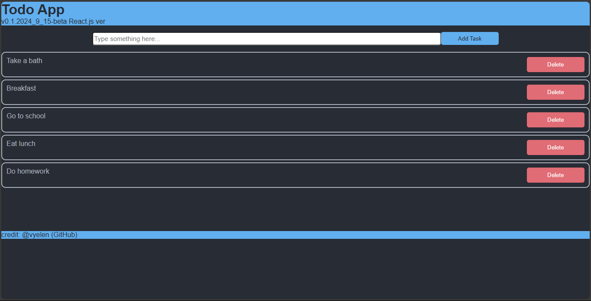

<h1>To Do App</h1>

note all your activity here ! (minimize the chance you forget your task) 

  
Preview

  

  
How to run

  <ul>
    <li>in the root project, run <code>npm i</code> to installing all module that the compiler need</li>
    <li>after that, run <code>npm start</code> to start the app</li>
  </ul>

